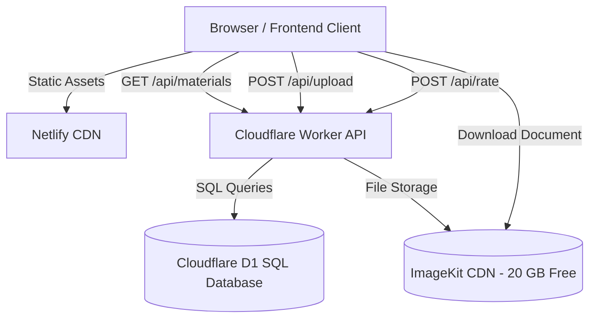

# 🎓 CampusVault [https://campusvault-btech.netlify.app/]

> **An open, community-driven study material repository for college students to easily share, discover, and rate lecture notes, assignments, and previous year examination papers.**

[](LICENSE)
[](static/index.html)
[-F38020?logo=cloudflare&logoColor=white)](https://developers.cloudflare.com/d1/)
[](worker.js)
[-05B4FF?logo=imagekit&logoColor=white)](https://imagekit.io)
[](https://www.netlify.com/)

---

## 🌟 Overview

**CampusVault** (CollegeHelper) empowers students across colleges to crowdsource and find high-quality academic resources. Whether preparing for mid-semesters, revising before end-terms, or submitting assignments, students can find curated notes tailored to their specific college and subjects.

The project is built on a modern **100% Serverless & Free Architecture** utilizing Cloudflare Workers, Cloudflare D1 (SQL), ImageKit CDN, and Netlify — requiring **zero hosting fees and no credit card commitments**.

---

## ✨ Features

- 📚 **Categorized Material Hub**:
  - Filter by **Notes**, **Assignments**, and **Past Examination Papers**.
  - Dynamic filtering by **College** and **Subject**.
  - Real-time search by title, description, or author.
- 🎨 **Modern Glassmorphic UI**:
  - Built with responsive Vanilla CSS and glassmorphic panels.
  - One-click **Dark / Light Theme** toggle with persistence.
  - Beautiful micro-animations and Lucide icon integration.
- ⚡ **Instant Document Contribution**:
  - Upload notes, question papers, and assignments (PDF, DOCX, IMG) directly from the browser.
  - Automatically compressed and delivered via ImageKit's global CDN.
- ⭐ **Community Star Rating**:
  - Rate study materials from 1 to 5 stars.
  - Dynamic recalculation of average ratings and total vote count.
  - Duplicate voting prevention per device.
- 🚩 **Content Moderation & Suggestions**:
  - Built-in reporting modal to flag inappropriate or misleading content.
  - Direct suggestion box for students to propose features.

---

## 🏗️ Architecture



| Layer | Technology | Free Tier Benefit |
| :--- | :--- | :--- |
| **Frontend** | HTML5, Modern CSS, Vanilla JS | Deployed on Netlify with automatic CI/CD |
| **API Backend** | Cloudflare Workers (`worker.js`) | 100,000 requests/day free, edge latency < 50ms |
| **Database** | Cloudflare D1 (SQLite) | 5M read units/day, 100k write units/day |
| **File Storage** | ImageKit.io | 20 GB free storage + 20 GB/month bandwidth |

---

## 📁 Project Structure

```text
CollegeHelper/
├── static/                     # Frontend website (Deploy this folder to Netlify)
│   ├── index.html              # Main HTML structure & modals
│   ├── app.js                  # Frontend logic & Worker API integration
│   ├── style.css               # Design system, glassmorphism & responsive styles
│   └── favicon.svg             # Graduation cap application icon
├── worker.js                   # Cloudflare Worker REST API backend
├── schema.sql                  # Database schema for Cloudflare D1
├── import_supabase.sql         # SQL migration script for previous database records
├── wrangler.jsonc              # Cloudflare Wrangler CLI configuration
├── netlify.toml                # Netlify deployment configuration
├── .gitignore                  # Git ignore rules
└── README.md                   # Project documentation
```

---

## 🚀 Quick Start (Local Development)

### 1. Clone the repository
```bash
git clone https://github.com/YOUR_USERNAME/CollegeHelper.git
cd CollegeHelper
```

### 2. Run the frontend locally
You can use any local static server:

Using Python:
```bash
python -m http.server 8080 --directory static
```

Or using Node (`npx serve`):
```bash
npx serve static
```

Open your browser at `http://localhost:8080`.

---

## 🌐 Deployment Guide

### Step 1: Deploy Backend on Cloudflare (Free)
1. Go to [Cloudflare Dashboard](https://dash.cloudflare.com/) > **Storage & Databases** > **D1 SQL Database**.
2. Create a database named `campusvault-db`.
3. Go to the **Console** tab, paste the contents of [`schema.sql`](schema.sql), and click **Execute**.
4. Go to **Compute (Workers & Pages)** > **Create Worker** named `campusvault-api`.
5. Paste the code from [`worker.js`](worker.js) into the online editor and click **Deploy**.
6. In Worker **Settings** > **Bindings**:
   - Add a D1 Database Binding: Variable name `DB`, select `campusvault-db`.
7. In Worker **Settings** > **Variables and Secrets**:
   - Add `IMAGEKIT_PRIVATE_KEY` with your private key from [imagekit.io](https://imagekit.io).
8. Copy your Worker URL: `https://campusvault-api.<your-subdomain>.workers.dev`.

### Step 2: Configure Frontend
In [`static/app.js`](static/app.js), set `API_BASE_URL` to your Cloudflare Worker URL:
```javascript
const API_BASE_URL = 'https://campusvault-api.<your-subdomain>.workers.dev';
```

### Step 3: Deploy Frontend on Netlify
* **Option A (Netlify Drop)**: Go to [app.netlify.com/drop](https://app.netlify.com/drop) and drag-and-drop the `static/` folder.
* **Option B (Git Integration)**: Connect this repository to Netlify. Netlify will automatically detect [`netlify.toml`](netlify.toml) and publish the `static` directory with zero manual configuration.

---

## 🛠️ API Reference (Cloudflare Worker)

| Method | Endpoint | Description |
| :--- | :--- | :--- |
| `GET` | `/api/materials` | Retrieves all materials ordered by newest first |
| `POST` | `/api/upload` | Uploads document to ImageKit and saves metadata in D1 |
| `POST` | `/api/rate` | Submits a star rating (1–5) and updates averages atomically |
| `POST` | `/api/clean-duplicates`| Cleans redundant rows from previous imports |

---

## 🤝 Contributing

Contributions are welcome! If you have suggestions or improvements:
1. Fork the Project.
2. Create your Feature Branch (`git checkout -b feature/NewFeature`).
3. Commit your Changes (`git commit -m 'Add some NewFeature'`).
4. Push to the Branch (`git push origin feature/NewFeature`).
5. Open a Pull Request.

---

## 📄 License

Distributed under the MIT License. See `LICENSE` for more information.
